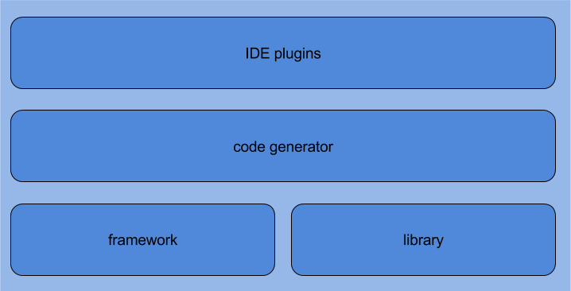

DAMapping library 
====================

The DAMapping library is a component of the [DAMapping bean mapping stack for Java](http://damapping.javatronic.fr).

The DAMapping's bean mapping library provides utility methods, class and patterns to help write all those recurrent, technical, bean mapping code: null and default value handling, primitive <-> Object mappings, enum mapping, collection mapping, etc... 

The library exposes meaningfully named classes and methods, leveraging the readability of [method chaining](http://en.wikipedia.org/wiki/Method_chaining) and [fluent interface](http://en.wikipedia.org/wiki/Fluent_interface) coding styles.

## Contact and support

Feel free to create an [issue](https://github.com/lesaint/damapping-library/issues) even to ask questions and/or contact me on [Twitter](https://twitter.com/LesaintSeb).
